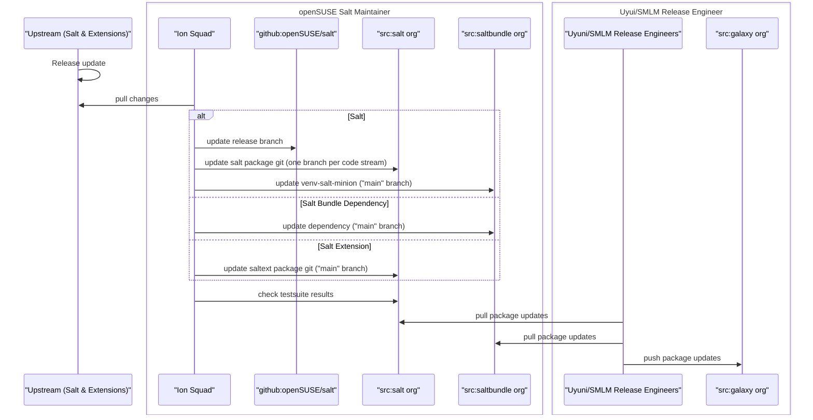

# Packaging Workflow

Each participant focuses on their own area.

## Sequence Diagram

## Examples

### SUSE Multi-Linux Manager Maintenance Update

Salt, Salt Bundle, and Salt Extension packages are up to date in `src.opensuse.org/salt/*`
and `src.opensuse.org/saltbundle/*`. The only missing step is to pull these updates into
`src.suse.de/galaxy/*` and prepare the Maintenance Update.

### SUSE Linux Enterprise Salt Maintenance Update

